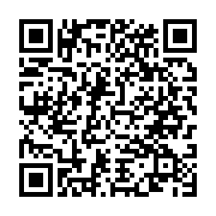
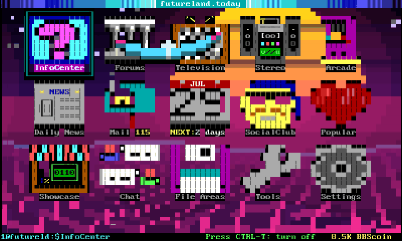
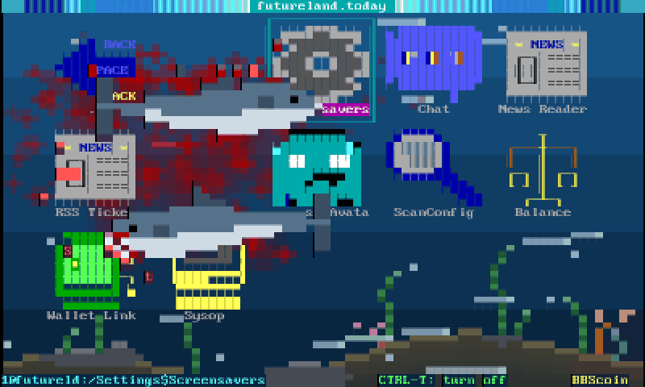
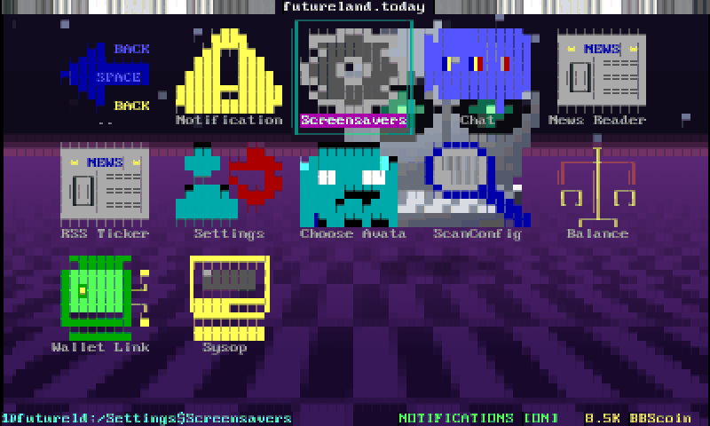
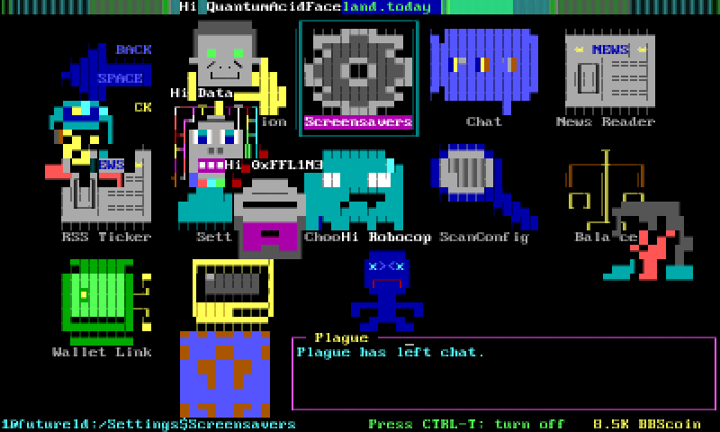

# 3dBBS

A BBS terminal for the Nintendo 3DS (homebrew) that renders **stereoscopic 3D
scenes, streamed audio, and sixel graphics driven by the BBS** over a plain
telnet connection — while remaining a faithful ANSI-BBS terminal compatible
with SyncTERM/CTerm conventions.

The client identifies as **CTerm 1.332**, so Synchronet's `*` terminal
autodetect and existing SyncTERM-aware BBS code work unmodified. On top of
that it adds an `APC 3DS:` escape-sequence namespace: a BBS can upload meshes
(cached and deduplicated), place and animate them, and move a camera — all
rendered with real stereo depth on the top screen, composited under the
terminal text.

## Install (QR)

Scan with **FBI → Remote Install → Scan QR Code** to install the latest
release over the air (CFW required):



The QR points at
`https://github.com/hmderdoc/3dBBS/releases/latest/download/3dBBS.cia`,
which always resolves to the newest release — it never needs regenerating.

## Screenshots

Live sessions on [futureland.today](https://futureland.today), captured off
the console's top screen. These are flat frames from the centre of the
stereo range — on the hardware the scene sits behind the menu at real depth.

| | |
|---|---|
|  |  |
|  |  |

## Documentation

- **[docs/PROTOCOL.md](docs/PROTOCOL.md)** — the complete wire-protocol
  reference for BBS-side authors: detection, terminal capabilities, the file
  cache, audio, sixel, and the 3D scene protocol. **Start here if you are
  writing BBS code (or are an agent doing so).**
- **[docs/3D-AUTHORING.md](docs/3D-AUTHORING.md)** — the depth model
  (how z maps to what the eye sees), screen-to-world math, authoring
  patterns, and notes on extending a frame.js-style layer library to real 3D.
- **[DESIGN.md](DESIGN.md)** — internal architecture and decision history.

## Building

Requires devkitPro with the 3DS toolchain (`dkp-pacman -S 3ds-dev`):

```
make            # produces 3dBBS.3dsx (Homebrew Launcher / 3dslink)
```

Deploy over Wi-Fi with the Homebrew Launcher netloader:

```
3dslink -a <3ds-ip> 3dBBS.3dsx
```

### Release packaging (.cia + QR install)

```
make RELEASE=1 cia      # 3dBBS.cia, dev scaffolding stripped
```

Needs `makerom` and `bannertool` in `tools/bin/` (not committed —
makerom from [Project_CTR](https://github.com/3DSGuy/Project_CTR/releases)
releases, bannertool built from
[carstene1ns/3ds-bannertool](https://github.com/carstene1ns/3ds-bannertool)).
`tools/make_qr.py <cia-url> qr.png` produces the FBI Remote-Install QR.

**Releases are automated**: pushing a tag `v*` runs
`.github/workflows/release.yml`, which builds the RELEASE `.cia`/`.3dsx`
in the devkitPro container, generates the QR pointing at the release
asset, and publishes all three as individual release assets — the layout
[Universal-DB](https://github.com/Universal-Team/db) consumes for
Universal-Updater listings.

## Testing

- `tests/host/run.sh` — host-native test suite for the terminal core
  (parser, wrap/region semantics, query replies, sixel decode, fixtures).
  Runs on the dev machine in about a second; run it after any core change.
- `tests/stress_server.py` — a fake "heavy BBS" (dense ANSI + streamed APC
  audio + a spinning 3D mesh demo). Doubles as **executable protocol
  documentation**: it emits exactly the byte sequences described in
  docs/PROTOCOL.md.
- `tools/relay.py --debug` — the relay (see below) in wire-logging mode:
  captures APC traffic, sixel payloads, a CSI usage census, and the client's
  UDP telemetry beacon on one timeline.

## WAN accelerator relay

The 3DS's TCP stack has a fixed 8 KB receive window, which caps sustained
downloads at `8192 / RTT` — about 45 KB/s from a board 180 ms away (full
measurements in DESIGN.md §7.5). Interactive use fits under that easily, but
high-bitrate audio streaming from a distant board does not.

`tools/relay.py` removes the cap by splitting the path: the 3DS connects
across your LAN (~2 ms, effectively unlimited), and the relay dials the BBS
with the host machine's real TCP stack. rlogin autologin handshakes pass
through untouched.

```
python3 tools/relay.py --host futureland.today --bbs-port 1513 --port 2324
```

Then point a phonebook entry at the relay machine's LAN IP, port 2324, and
dial that. Entirely optional — direct connections always work; the relay only
raises the throughput ceiling.

## Controls

| Input | Action |
|---|---|
| Disconnected | bottom screen is the **phonebook editor**: tap a board to select, tap again to dial; buttons DIAL / EDIT / USER / PROTO / SIZE / ADD / DEL |
| D-pad up/down, A, Y, X (disconnected) | select, dial, set credentials, toggle protocol |
| Tap status bar (connected) | disconnect |
| SELECT | display mode: keyboard → mirror → tall |
| Touch keyboard | input (shift/ctrl sticky); taps on mirrored terminal send mouse clicks |
| D-pad (connected) | arrow keys; A=Enter B=Backspace X=Space Y=Esc |
| Hold START ~1.5s | quit |

## Connecting and autologin

Boards are managed on-device in the phonebook editor (the bottom screen
while disconnected): **EDIT** changes name/host/port, **ADD** creates an
entry, **DEL** removes one (tap twice to confirm), **USER** stores
credentials, **PROTO** cycles telnet → rlogin → ssh, **SIZE** cycles the
terminal geometry. Everything persists immediately to
`sdmc:/3dBBS/phonebook.txt`, which can also be edited directly:

```
name|host|port|proto|user|pass|flags|size   # proto: telnet, rlogin or ssh
```

Trailing fields are optional (3 fields = telnet, no credentials). `flags`
is free text: `3d` marks a board known to drive the stereoscopic scene
protocol — those entries get an animated magenta/cyan border in the list
(the KEY at the bottom explains it). The tag is tracked locally on your
list, editable like everything else; the defaults ship with
**futureland.today** as the first 3D-capable board, plus a handful of
showcase boards (each one verified answering before inclusion).

**rlogin autologins**: the stored username and password ride the RFC 1282
handshake in SyncTERM's field order (password in the client-username slot,
username in the server-username slot) — the same convention fTelnet uses, so
Synchronet logs you straight in. The handshake's terminal-type field is sent
as `ansi-bbs-cp437-truecolor`, which is what boards key 24-bit colour off.
Port 513 is the generic default; Futureland ships configured for **1513**.
Telnet connections do not autologin — credentials are stored but not sent
(no prompt-matching yet).

> **Credentials are stored in plain text** on the SD card, exactly as
> SyncTERM's `syncterm.lst` does. Anyone with physical access to the card can
> read them. Leave the password empty for boards where that matters.

**SSH** is supported when the build includes libssh2 (`dkp-pacman -S
3ds-mbedtls`, then `tools/build_libssh2.sh`; the Makefile switches
`ENABLE_SSH` on automatically). SSH entries require stored credentials
(USER button) — the username authenticates the SSH session itself. Host
keys are accepted without verification in v1: the wire is encrypted, but
the far end is not authenticated yet (TOFU pinning is a TODO). Builds
without libssh2 fail SSH dials cleanly.

## Splash screen

Before you dial, the top screen shows the product name rendered in
**TheDraw fonts** — the ANSI-scene bitmap fonts BBSes have used for banner
art since the early 90s — with four copies drifting independently through
3D space at real stereo depth, each respawning in a new random font.

Only the finished renderings are compiled in, never the fonts: 206 of them
in about 95 KB. `assets/gen_tdf_splash.py` parses a `.tdf` collection at
build time (Synchronet's `ctrl/tdfonts/` is the canonical one) and emits
`source/gfx/tdf_splash_data.c` as CP437 cell grids, so the console needs no
TDF parser and no font files on the SD card. Regenerate with a different
string via `--text`.

Two things that shaped the result and are worth knowing if you re-run it:

- **Over half the library can't render the name.** TheDraw fonts index
  ASCII 33..126 through a 94-entry offset table, and a great many mark the
  digits absent (`0xFFFF`). "3D BBS" needs a `3`, so 1,867 of 3,474 fonts
  are unusable and are dropped — without that filter they silently render
  "D BBS".
- **The collections ship greyscale "silver" variants** beside the colour
  originals, and they made the splash look drab. Each banner is scored for
  colour at bake time; the monochrome ones get a random hue multiplied
  through their grey levels at runtime, which keeps the `░▒▓█` shading
  intact rather than dropping those fonts.

Font credits are in [assets/TDF-FONTS-CREDITS.md](assets/TDF-FONTS-CREDITS.md).

## Terminal size

Each board carries its own geometry, because boards disagree: some draw for
80x25, some assume a taller screen. **SIZE** cycles the SyncTERM screen
modes — 80x25/28/30/43/50/60 and 132x25/28/30/34/43/50/60 — and wraps back
to the default. For anything off that list, **EDIT** ends with a
`COLSxROWS` prompt; clearing it restores the default. The chosen size shows
in the list next to the board and is written as the `size` column.

The size is applied *before* dialing, so whichever handshake announces it
(telnet NAWS, the rlogin termtype field, the SSH pty request) carries the
real geometry. A board that later asks for a different size with CSI t
still wins — and `CSI 0;0 t` ("restore default") returns to the board's
configured size rather than a hardcoded 80x25.

132 columns on a 400px screen is about three pixels per glyph. It is
offered because SyncTERM offers it and boards are authored for it; it is
readable in **tall** mode (SELECT) and not much else. 132x60 is also the
ceiling — it's the largest screen CTerm documents, and the renderer's
vertex and command buffers are sized from exactly that grid.

## Effective speed

While connected, the status bar reports the receive rate as a modem-style
bit rate with a session peak: `Futureland rlogin*  361.2k bps  pk 402.4k`.
The peak resets on each dial, so dialing a board direct and then through
the relay gives two numbers you can put side by side — which is the point,
given the fixed 8 KB window (DESIGN.md §7.5) makes distance, not
bandwidth, the limit.

## Settings

Global preferences live in `sdmc:/3dBBS/settings.txt`, written with
commented defaults on first run:

```
lid_keepalive_min=5     # keep a live session up this long after lid close
led=1                   # RGB notification LED tracks the data stream
```

**Lid keepalive** stops a closed lid from dropping the session. Closing the
lid normally sleeps the console, which kills the TCP connection mid-BBS;
with this set the console instead stays awake for the configured window,
then sleeps normally. It is a real battery cost — the console is running,
just with dark screens — so it is bounded (max 60 minutes) and `0` turns it
off entirely. While the lid is shut the app skips drawing altogether and
only keeps the socket drained.

Refusing sleep is only half of it: the network daemon manager will drop the
infrastructure connection on its own schedule regardless of sleep state, so
the app also takes `NDMU_EnterExclusiveState(INFRASTRUCTURE)` and
`NDMU_LockState()` for its lifetime — the same pairing ftpd uses. A side
effect is that SpotPass and friends stay suspended while 3dBBS runs, which
is no loss on a link with an 8 KB window.

**LED** drives the RGB notification LED — the StreetPass/SpotPass one —
from the data stream, read like a VU meter. Colour is the load: green when
idle, through yellow-green and amber, to red at the ~45 KB/s ceiling a
distant board can actually reach. Brightness pulses on top of that, once
every few seconds when idle and around 2 Hz under load, with peak-meter
ballistics (fast attack, slow decay) so a single screen paint visibly kicks
it up the scale. Dark when disconnected.

The MCU animates the 32-step pattern itself, so this costs one I2C write
per level change rather than anything per frame. Hue is deliberately
constant within a pattern: sweeping the spectrum across the steps and
letting the MCU smooth between them averages the colour wheel and comes out
white. Needs `mcu::HWC`; if that can't be opened the LED is left alone.

## Status / dev notes

Working: terminal core (truecolor, iCE, DECSTBM, dynamic geometry + NAWS),
SyncTERM-compatible identification and query surface, APC audio engine with
JIT streaming, sixel with correct scroll/overwrite lifetime, 3D scene
protocol v1, text depth layers (protocol 0.3 — terminal text at real stereo
depths, PROTOCOL.md §7), three-thread architecture (net+render / APC worker /
SD flush), telnet/rlogin/SSH, per-board terminal geometry, effective-speed
readout, lid-close keepalive, RGB LED data indicator, TheDraw-font splash.

Dev builds (`make`) include scaffolding: perf overlay, UDP telemetry
beacon, L-button test probe, `LocalTest`/`FL-Proxy` phonebook entries with
hardcoded dev-machine IPs. **`make RELEASE=1` excludes all of it** — the
release binary contains no telemetry and no dev IPs (verified with
`strings` on the ELF).

Licensing: vendored Synchronet sources (`vendor/synchronet/`, fonts + CTerm
spec) are GPL; this project is consequently licensed under the **GNU GPL v2**
(see [LICENSE](LICENSE)).
